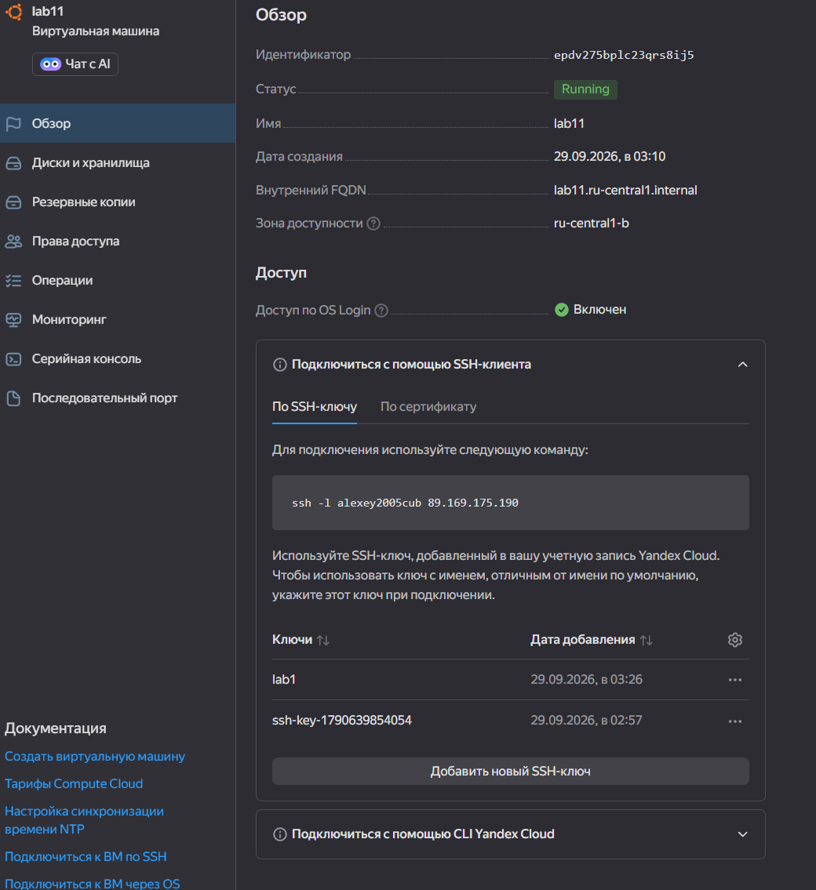
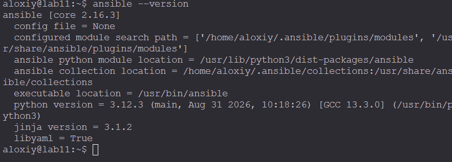
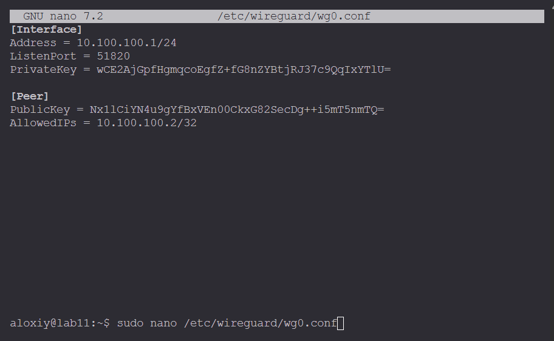
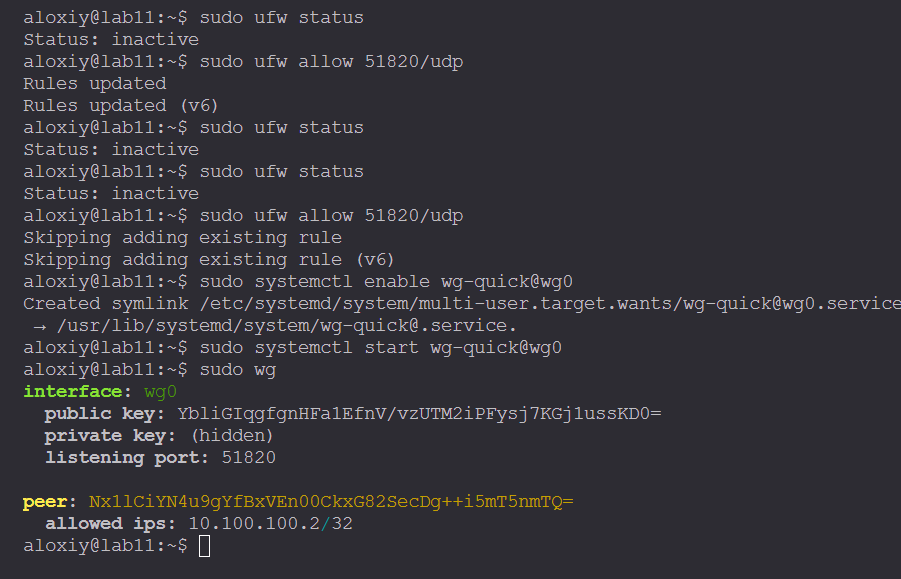
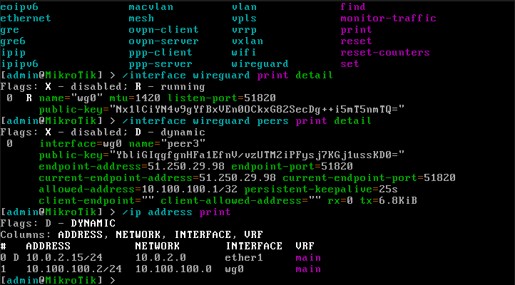
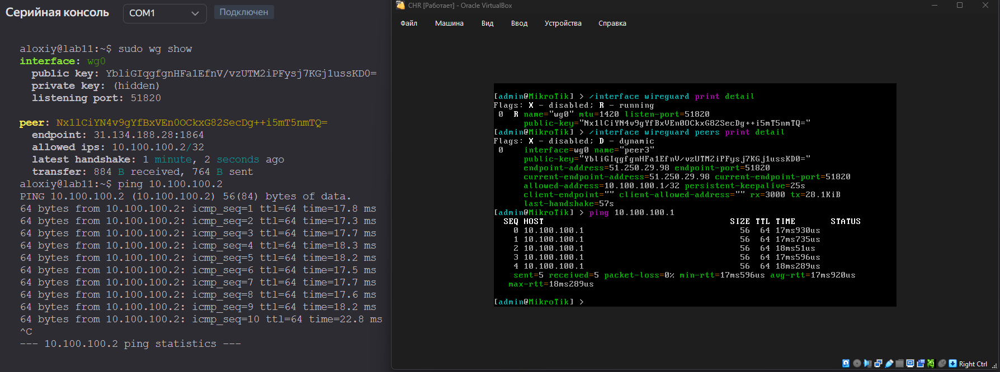

# Лабораторная работа №1

## Задание

<https://itmo-ict-faculty.github.io/network-programming/education/labs2023_2024/lab1/lab1/>


### VM





### VPN-сервер

Установка пакетов:

```bash
sudo apt update
sudo apt install wireguard
sudo apt install iptables-persistent
```

Генерация ключей:

```bash
wg genkey | tee server_private.key | wg pubkey > server_public.key
wg genkey | tee client_private.key | wg pubkey > client_public.key
```

Настройка /etc/wireguard/wg0.conf




Запуск сервера:



### VPN-клиент



### Тест

Ping с сервера на роутер и наоборот:



## Заключение

В результате выполнения лабораторной работы была проведена установка CHR и Ansible, настройка VPN Wireguard.
