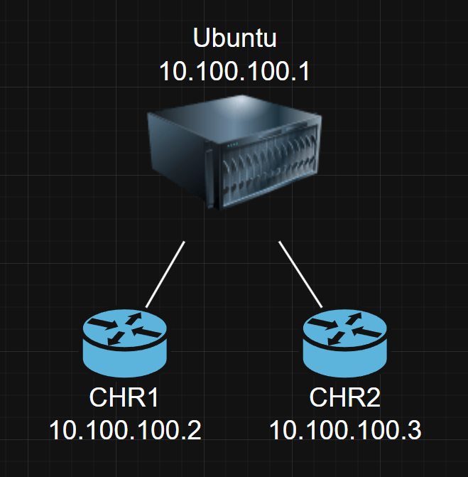
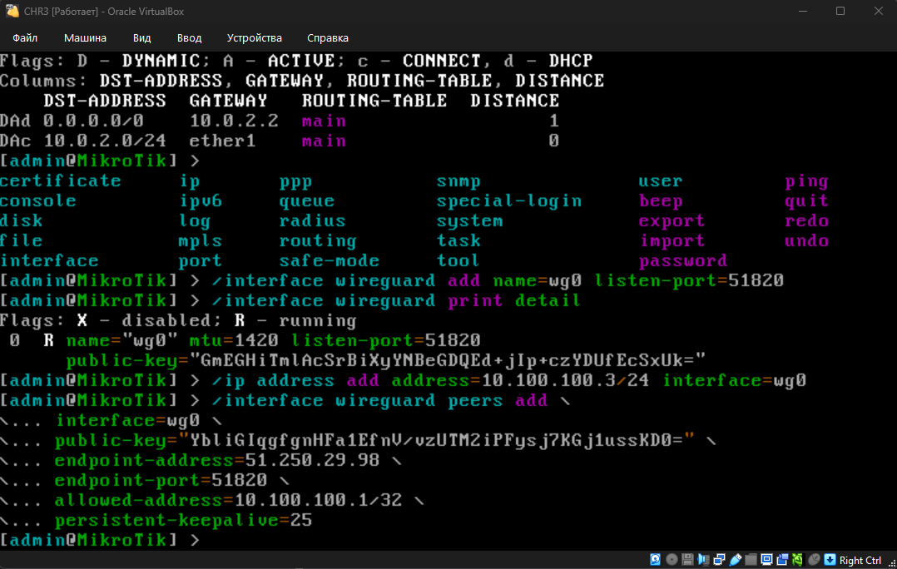
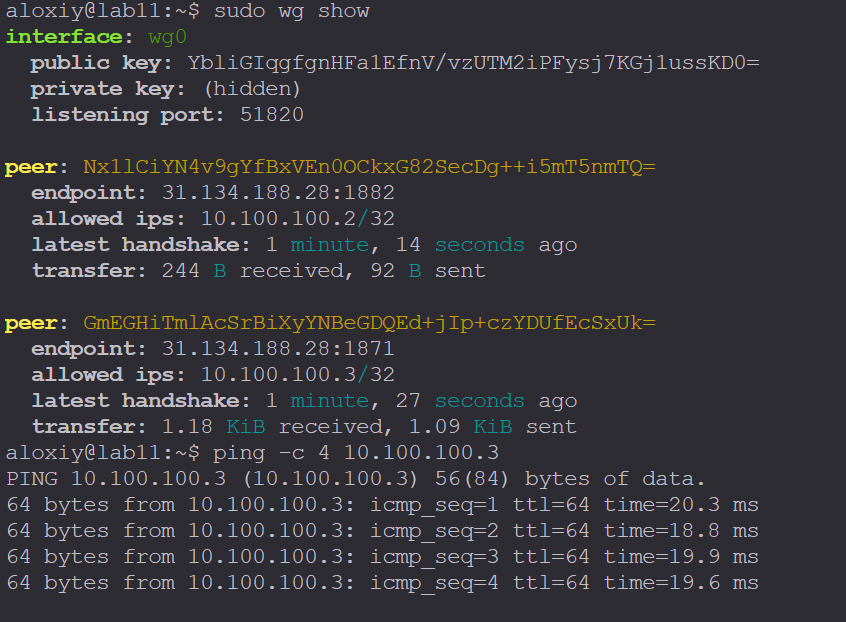
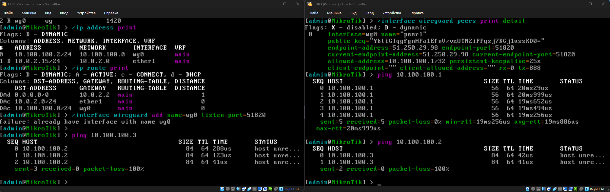
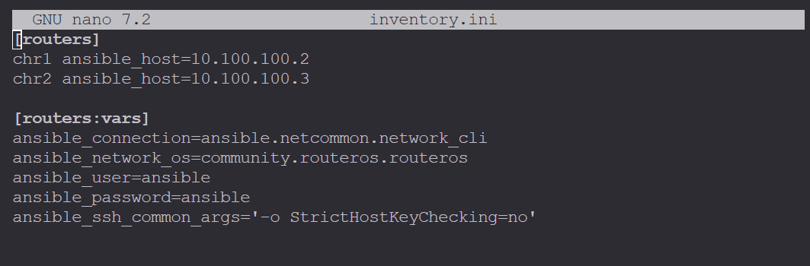
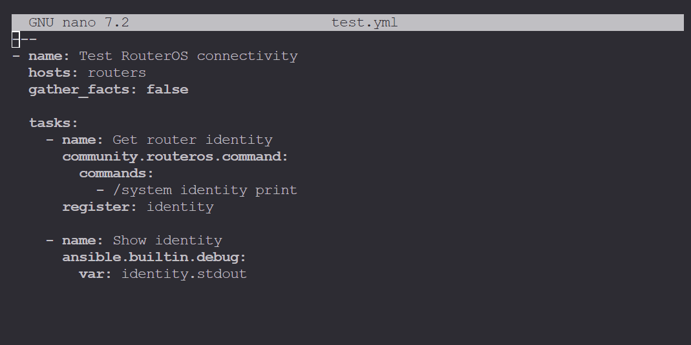
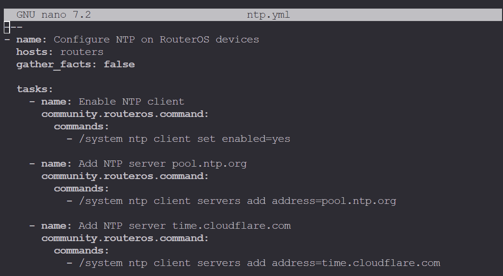
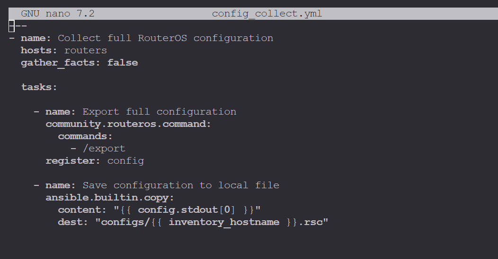
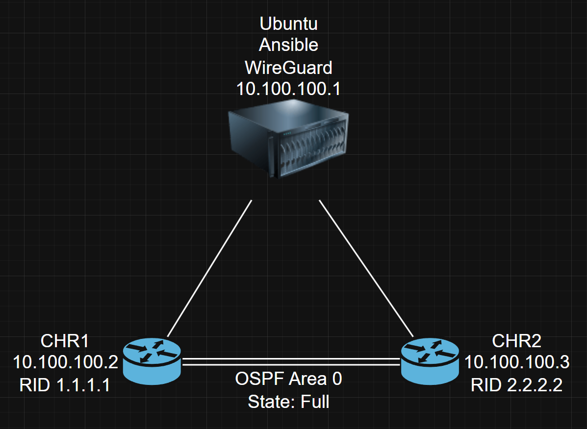

# Лабораторная работа №2
## Развертывание дополнительного CHR, первый сценарий Ansible
<https://ex-itmo-ict-faculty.github.io/network-programming/education/labs2023_2024/lab2/lab2/>

**Студент:** Алексей Зубов  
**Логин:** `aloxiy`

---

## 1. Цель работы

Цель лабораторной работы — развернуть дополнительный виртуальный маршрутизатор MikroTik CHR и научиться автоматически настраивать несколько сетевых устройств с помощью Ansible.

В ходе работы необходимо:

- развернуть второй CHR;
- настроить WireGuard-соединение;
- проверить связь между двумя CHR;
- настроить подключение к маршрутизаторам через Ansible;
- создать пользователя для Ansible;
- настроить NTP;
- настроить OSPF;
- проверить состояние OSPF-соседей;
- собрать информацию о топологии;
- сохранить конфигурации маршрутизаторов.

---

# 2. Используемое оборудование и ПО

В работе использовались:

- Ubuntu Server 24.04.5 LTS;
- MikroTik CHR;
- RouterOS 7.21.4;
- Ansible 2.16.3;
- VirtualBox;
- WireGuard;
- OSPFv2.

В качестве сервера управления используется Ubuntu с установленным Ansible.

---

# 3. Развертывание второго CHR

Первым этапом работы был скачан и запущен второй экземпляр MikroTik CHR в VirtualBox.

В результате в лаборатории появились два маршрутизатора:

```text
CHR1
CHR2
````

Оба устройства работают под управлением RouterOS:

```text
RouterOS 7.21.4
```

Для подключения к маршрутизаторам в дальнейшем используется Ansible.

---

# 4. Настройка WireGuard

После создания второго CHR первым делом было настроено WireGuard-соединение.

Для WireGuard используется сеть:

```text
10.100.100.0/24
```

Адреса распределены следующим образом:

| Устройство | Интерфейс | IP                |
| ---------- | --------- | ----------------- |
| Ubuntu     | `wg0`     | `10.100.100.1/24` |
| CHR1       | `wg0`     | `10.100.100.2/24` |
| CHR2       | `wg0`     | `10.100.100.3/24` |

WireGuard использует порт:

```text
51820/UDP
```

Схема соединения:



В данной схеме Ubuntu является центральным узлом WireGuard, через который маршрутизируются пакеты между CHR.

Для работы маршрутизации между CHR на Ubuntu был включён IP forwarding:

```bash
sudo sysctl -w net.ipv4.ip_forward=1
```




---

# 5. Проверка WireGuard

После настройки WireGuard была проверена связь между CHR.

Сначала проверялась связь каждого CHR с Ubuntu:

```text
CHR1 → Ubuntu
CHR2 → Ubuntu
```


После включения IP forwarding и настройки `allowed-address` была проверена связь непосредственно между CHR:

```text
CHR1 → CHR2
CHR2 → CHR1
```

Связь успешно установилась.



Это позволило использовать сеть `10.100.100.0/24` для дальнейшей настройки OSPF.

---

# 6. Подготовка Ansible

После настройки WireGuard был подготовлен сервер Ubuntu для управления маршрутизаторами.

Проверка версии Ansible:

```bash
ansible --version
```

Используемая версия:

```text
ansible [core 2.16.3]
```

Для работы с RouterOS использовалась коллекция:

```text
community.routeros
```

---

# 7. Создание Inventory

Для Ansible был создан файл `inventory.ini`.



Таким образом, Ansible знает адреса обоих маршрутизаторов:

```text
CHR1 → 10.100.100.2
CHR2 → 10.100.100.3
```

---

# 8. Проверка подключения через Ansible

Для проверки подключения был создан playbook `test.yml`.



```yaml
---
- name: Test RouterOS connectivity
  hosts: routers
  gather_facts: false

  tasks:
    - name: Get router identity
      community.routeros.command:
        commands:
          - /system identity print
      register: identity

    - name: Show identity
      ansible.builtin.debug:
        var: identity.stdout
```

Запуск:

```bash
ansible-playbook test.yml
```

Ansible успешно подключился к обоим маршрутизаторам.

---

# 9. Настройка NTP

Следующим этапом была настроена синхронизация времени.

На обоих маршрутизаторах был включён NTP-клиент.

Использовались серверы:

```text
pool.ntp.org
time.cloudflare.com
```

Playbook:



После настройки NTP-клиент на обоих устройствах был включён.

---

# 10. Настройка OSPF

После того как WireGuard и Ansible были настроены, следующим этапом стала настройка динамической маршрутизации OSPF.

Для каждого маршрутизатора был назначен свой Router ID.

| Маршрутизатор | Router ID |
| ------------- | --------- |
| CHR1          | `1.1.1.1` |
| CHR2          | `2.2.2.2` |

Используется OSPF версии 2.

---

# 11. Создание OSPF instance

ВСЕ КОМАНДЫ НАПИСАННЫЕ ДАЛЕЕ БЫЛИ ИСПОЛЬЗОВАНЫ С ПОМОЩЬЮ Ansible, а НЕ применены непосредственно на роутерах

На CHR1:

```text
/routing ospf instance add name=default-v2 router-id=1.1.1.1 version=2
```

На CHR2:

```text
/routing ospf instance add name=default-v2 router-id=2.2.2.2 version=2
```

В результате:

```text
CHR1 → Router ID 1.1.1.1
CHR2 → Router ID 2.2.2.2
```

---

# 12. Создание OSPF Area

Для обоих маршрутизаторов была создана backbone area:

```text
backbone
Area ID: 0.0.0.0
```

Команда:

```text
/routing ospf area add name=backbone area-id=0.0.0.0 instance=default-v2
```

Оба маршрутизатора используют одну и ту же OSPF Area.

---

# 13. Добавление WireGuard-сети в OSPF

В OSPF была добавлена сеть:

```text
10.100.100.0/24
```

которая находится на интерфейсе `wg0`.

Команда:

```text
/routing ospf interface-template add area=backbone networks=10.100.100.0/24
```

Таким образом, OSPF работает поверх WireGuard-сети.

---

# 14. Настройка типа OSPF-сети

Сначала интерфейс WireGuard был настроен как `point-to-point`.

Однако OSPF-соседство в такой конфигурации не установилось.

После этого тип сети был изменён на:

```text
NBMA
```

Для NBMA были настроены статические OSPF-соседи.

На CHR1:

```text
/routing ospf static-neighbor add \
    address=10.100.100.3%wg0 \
    area=backbone
```

На CHR2:

```text
/routing ospf static-neighbor add \
    address=10.100.100.2%wg0 \
    area=backbone
```

В результате маршрутизаторы получили информацию о том, где находится их OSPF-сосед.

---

# 15. Проверка OSPF-соседей

Для проверки использовалась команда:

```text
/routing ospf neighbor print detail
```

На CHR1:

```text
address=10.100.100.3
router-id=2.2.2.2
state="Full"
```

На CHR2:

```text
address=10.100.100.2
router-id=1.1.1.1
state="Full"
```

Состояние:

```text
Full
```

означает, что OSPF-соседство полностью установлено.

---

# 16. DR и BDR

После установления OSPF-соседства были определены DR и BDR.

```text
DR  = 10.100.100.3
BDR = 10.100.100.2
```

То есть:

```text
CHR2 → DR
CHR1 → BDR
```

Состояние интерфейсов:

```text
CHR1 → state=bdr
CHR2 → state=dr
```

---

# 17. Проверка связности

После настройки OSPF была выполнена проверка ping.

## CHR1 → CHR2

```text
sent=4
received=4
packet-loss=0%
avg-rtt=38.497 ms
```

## CHR2 → CHR1

```text
sent=4
received=4
packet-loss=0%
avg-rtt=38.378 ms
```

Потери пакетов составили:

```text
0%
```

Таким образом, связь между маршрутизаторами работает в обе стороны.

---

# 18. Сбор информации о топологии

Для получения информации о состоянии OSPF был создан playbook `ospf_topology.yml`.

В нём выполняются команды:

```text
/routing ospf neighbor print detail
/routing ospf interface print detail
/routing ospf instance print detail
/routing ospf area print detail
```

С помощью этого playbook была получена информация:

* об OSPF-соседях;
* об интерфейсах OSPF;
* об OSPF instance;
* об OSPF Area.

Полученная информация подтверждает наличие соседства:

```text
CHR1 ←→ CHR2
      Full
```

---

# 19. Получение конфигураций

После завершения настройки была получена полная конфигурация обоих маршрутизаторов.

Для этого использовался playbook `config_collect.yml`.



После выполнения были получены файлы [chr1.rsc](routers/chr1.rsc) и [chr2.rsc](routers/chr2.rsc):

---

# 20. Итоговая схема

Итоговая схема лабораторной работы:



---

# 21. Итоговая конфигурация

### CHR1

```text
WireGuard:
    wg0
    10.100.100.2/24

OSPF:
    Router ID: 1.1.1.1
    Instance: default-v2
    Area: 0.0.0.0
    Network: 10.100.100.0/24
    Type: NBMA

OSPF neighbor:
    10.100.100.3

State:
    Full

Role:
    BDR
```

### CHR2

```text
WireGuard:
    wg0
    10.100.100.3/24

OSPF:
    Router ID: 2.2.2.2
    Instance: default-v2
    Area: 0.0.0.0
    Network: 10.100.100.0/24
    Type: NBMA

OSPF neighbor:
    10.100.100.2

State:
    Full

Role:
    DR
```

---

# 22. Финальная проверка

Для окончательной проверки был создан [final_check.yml](ansible/final_check.yml).

Он позволяет одним запуском получить:

* информацию об устройствах;
* IP-адреса;
* таблицу маршрутизации;
* NTP;
* OSPF;
* OSPF-соседей;
* результат ping между CHR.

Запуск:

```bash
ansible-playbook final_check.yml
```

---

# 23. Результаты работы

В результате выполнения лабораторной работы:

1. Был скачан и запущен второй MikroTik CHR.
2. На втором CHR был настроен WireGuard.
3. Между Ubuntu, CHR1 и CHR2 была создана WireGuard-сеть `10.100.100.0/24`.
4. Была проверена связь между двумя CHR.
5. На Ubuntu был установлен и настроен Ansible.
6. Ansible был подключён к обоим маршрутизаторам.
7. На CHR был создан пользователь `ansible`.
8. Был настроен NTP-клиент.
9. Был настроен OSPFv2.
10. Для маршрутизаторов были назначены Router ID.
11. Была создана backbone Area `0.0.0.0`.
12. WireGuard-сеть была добавлена в OSPF.
13. Для OSPF был настроен тип сети NBMA.
14. Были настроены статические OSPF-соседи.
15. OSPF-соседство перешло в состояние `Full`.
16. CHR2 стал DR, а CHR1 — BDR.
17. Ping между CHR показал `0%` потерь.
18. С помощью Ansible была собрана информация о топологии.
19. Были сохранены конфигурации обоих маршрутизаторов.
20. Был создан финальный playbook для проверки состояния лабораторной.

---

# 24. Вывод

В ходе лабораторной работы был развернут второй виртуальный маршрутизатор MikroTik CHR и организовано его подключение к существующей инфраструктуре с помощью WireGuard.

После проверки сетевой связности было настроено управление обоими маршрутизаторами с помощью Ansible. С его помощью были автоматизированы основные операции настройки: создание пользователя, настройка NTP и настройка OSPF.

На обоих маршрутизаторах был настроен OSPFv2. После настройки NBMA и статических соседей маршрутизаторы установили OSPF-соседство в состоянии `Full`.

Работоспособность соединения была подтверждена двусторонним ping с потерями `0%`.

Таким образом, в результате работы были изучены основы автоматизации настройки сетевых устройств с помощью Ansible, а также настройка WireGuard и OSPF на MikroTik RouterOS.

```
```
