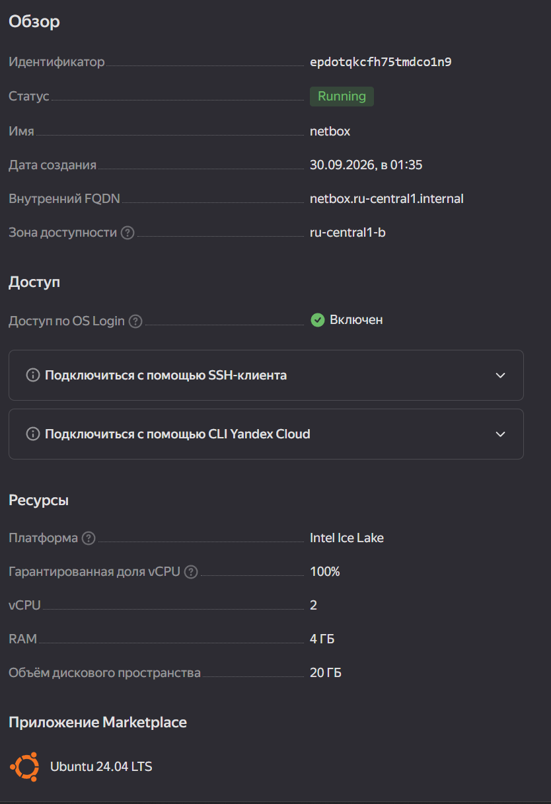
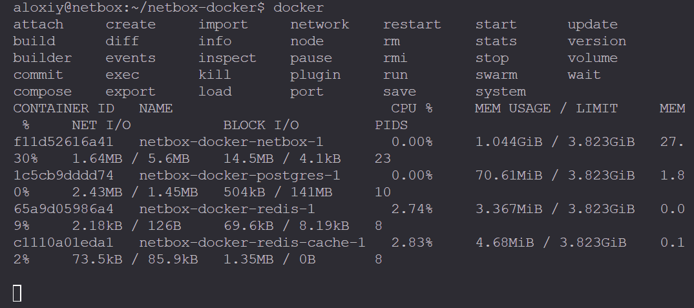
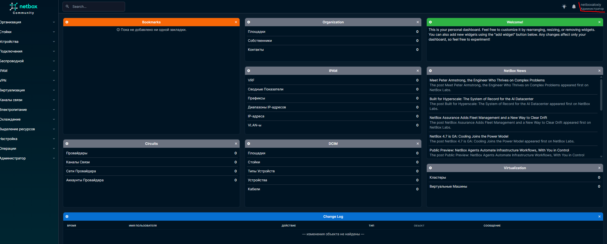
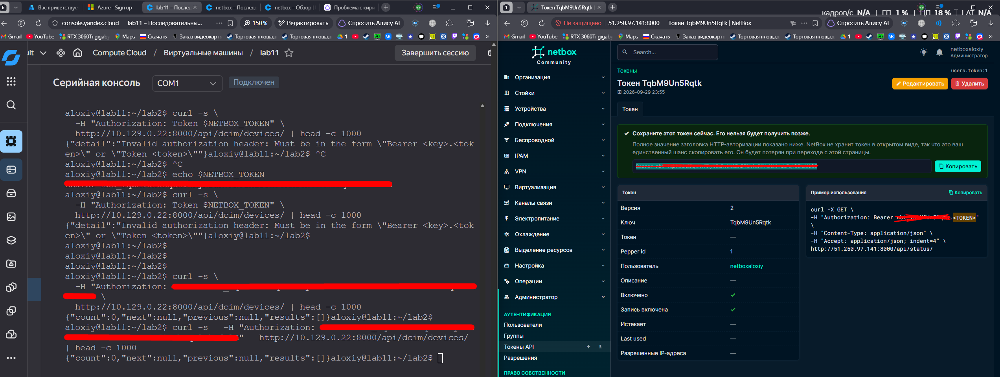
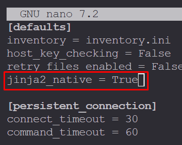
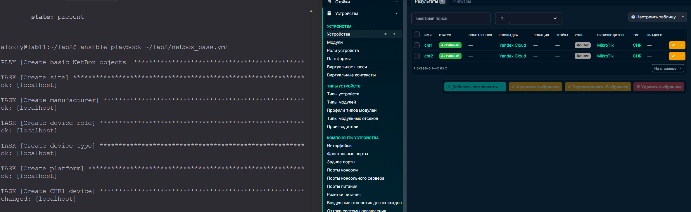
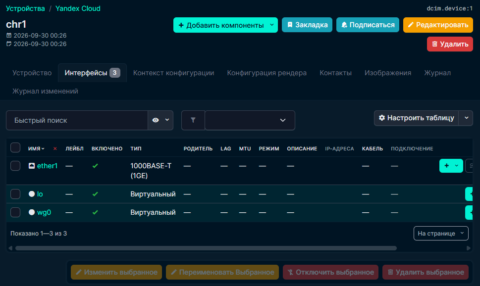
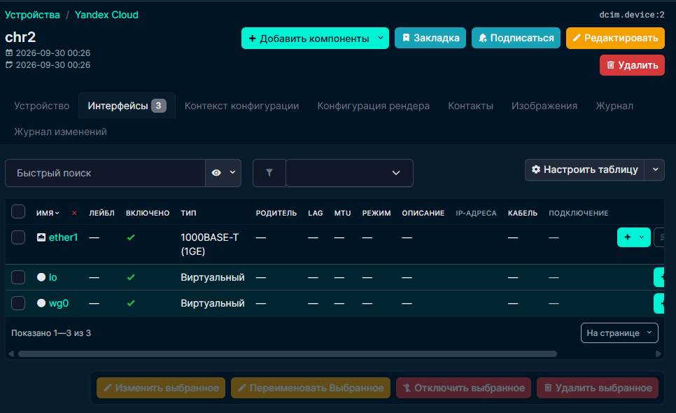
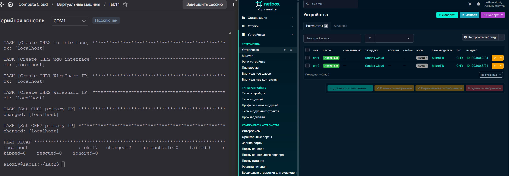
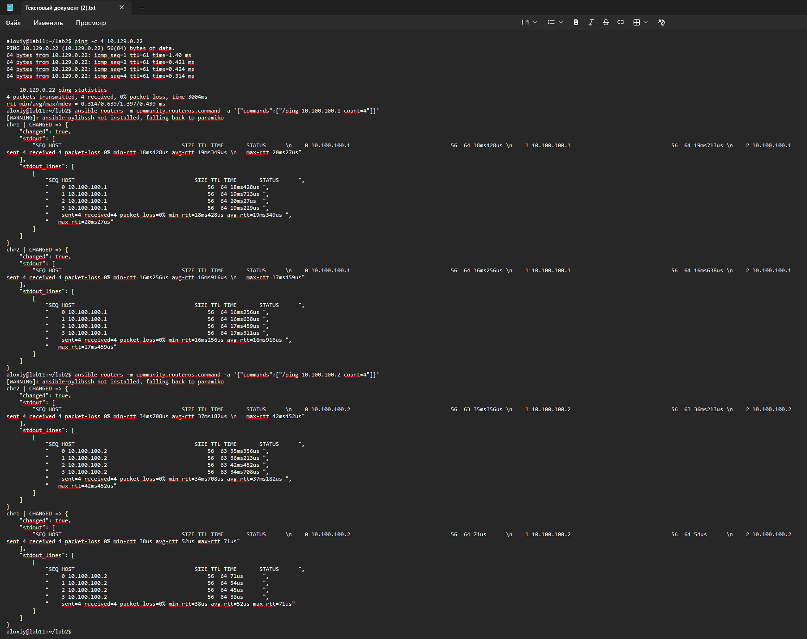

# Лабораторная работа №3

## Развёртывание NetBox, сеть связи как источник правды в системе технического учёта NetBox

<https://ex-itmo-ict-faculty.github.io/network-programming/education/labs2023_2024/lab3/lab3/>

**Студент:** Зубов Алексей


---

## 1. Цель работы

Целью лабораторной работы является получение практических навыков развёртывания и использования системы технического учёта **NetBox**, а также организации взаимодействия между NetBox, Ansible и сетевыми устройствами MikroTik CHR.

В рамках работы необходимо:

1. Развернуть NetBox на отдельной виртуальной машине.
2. Добавить в NetBox информацию о двух устройствах MikroTik CHR.
3. Получить информацию о CHR с помощью Ansible и сохранить её в NetBox.
4. Сохранить данные NetBox в отдельный файл с использованием Ansible.
5. Разработать сценарий, позволяющий получать данные из NetBox и применять их к двум CHR.
6. Разработать сценарий сбора идентификатора устройства с CHR и сохранения его в NetBox.
7. Проверить сетевую связность между компонентами лабораторной инфраструктуры.

---

# 2. Исходная инфраструктура

В лабораторной работе использовалась инфраструктура, созданная в предыдущей лабораторной работе.

Основные компоненты:

| Устройство | Назначение                                       | IP-адрес       |
| ---------- | ------------------------------------------------ | -------------- |
| `lab11`    | Ubuntu Server, Ansible Controller, WireGuard hub | `10.129.0.31`  |
| `netbox`   | Ubuntu Server, NetBox                            | `10.129.0.22`  |
| `CHR1`     | MikroTik Cloud Hosted Router                     | `10.100.100.2` |
| `CHR2`     | MikroTik Cloud Hosted Router                     | `10.100.100.3` |

Для связи между CHR и сервером `lab11` используется WireGuard:

```text
lab11    10.100.100.1/24
CHR1     10.100.100.2/24
CHR2     10.100.100.3/24
```

При этом `lab11` выполняет роль центрального узла WireGuard.

---

# 3. Схема взаимодействия

Общая логическая схема инфраструктуры:

```text
                         Yandex Cloud
                              |
               +--------------+--------------+
               |                             |
          Ubuntu lab11                  NetBox VM
          10.129.0.31                   10.129.0.22
               |                         :8000
               |
        WireGuard hub
          10.100.100.1
           /         \
          /           \
  10.100.100.2     10.100.100.3
       CHR1              CHR2
```

Ansible Controller располагается на `lab11` и используется для управления обоими CHR.

Взаимодействие имеет два основных направления:

```text
                    NetBox
                  ↕        ↕
              REST API      |
                  ↕          |
               Ansible      |
                /   \       |
               ↓     ↓      |
             CHR1   CHR2 <---+
```

NetBox используется как централизованный источник информации об устройствах.

---

# 4. Развёртывание NetBox

Для NetBox была создана отдельная виртуальная машина:




На виртуальную машину были установлены Docker и Docker Compose:

```bash
sudo apt update
sudo apt upgrade -y

sudo apt install -y git curl
sudo apt install -y docker.io docker-compose-v2

sudo systemctl enable --now docker
```

После этого был загружен официальный Docker-проект NetBox:

```bash
git clone -b release https://github.com/netbox-community/netbox-docker.git
cd netbox-docker
```

Для доступа к NetBox из сети был изменён Docker Compose override:

```yaml
services:
  netbox:
    ports:
      - "8000:8080"
```

После этого контейнеры NetBox были запущены:



После завершения миграций приложение перешло в состояние `healthy`.

NetBox был доступен по адресу:

```text
http://10.129.0.22:8000
```



Был создан API Token для подключения



---

# 5. Подготовка Ansible

Для работы с MikroTik использовалась коллекция:

```text
community.routeros
```

Для работы с NetBox была установлена коллекция:

```text
netbox.netbox 3.23.0
```

Также используется библиотека Python:

```text
pynetbox 7.0.0
```

Для корректной передачи числовых значений custom fields в NetBox был включён native Jinja2:




---

# 6. Заполнение NetBox базовой информацией

С помощью Ansible был создан playbook `netbox_base.yml`.

В NetBox были созданы:

* Site `Yandex Cloud`;
* Manufacturer `MikroTik`;
* Device Role `Router`;
* Device Type `MikroTik CHR`;
* Platform `RouterOS`;
* устройства `chr1` и `chr2`;
* интерфейсы `ether1`, `lo` и `wg0` для каждого устройства;
* IP-адреса WireGuard;
* primary IP для каждого CHR.

Базовая информация про роутеры



Добавление интерфейсов




Добавление primary IP




В результате NetBox содержит следующую структуру:

```text
Yandex Cloud
└── MikroTik CHR
    ├── chr1
    │   ├── ether1
    │   ├── lo
    │   └── wg0
    │       └── 10.100.100.2/24
    │
    └── chr2
        ├── ether1
        ├── lo
        └── wg0
            └── 10.100.100.3/24
```

---

# 7. Создание дополнительных полей NetBox

Для хранения специфичной информации MikroTik CHR были созданы custom fields:

| Поле                 | Тип     | Назначение                             |
| -------------------- | ------- | -------------------------------------- |
| `routeros_version`   | text    | Версия RouterOS                        |
| `architecture`       | text    | Архитектура устройства                 |
| `cpu`                | text    | Тип процессора                         |
| `cpu_count`          | integer | Количество CPU                         |
| `cpu_frequency_mhz`  | integer | Частота CPU                            |
| `total_memory_mb`    | integer | Общий объём памяти                     |
| `free_memory_mb`     | integer | Свободная память                       |
| `total_disk_mb`      | integer | Общий объём диска                      |
| `free_disk_mb`       | integer | Свободное место                        |
| `board_name`         | text    | Название платы/виртуального устройства |
| `license_level`      | text    | Уровень лицензии RouterOS              |
| `routeros_system_id` | text    | System ID RouterOS                     |
| `ether1_mac`         | text    | MAC-адрес ether1                       |

Для создания этих полей использовался [netbox_custom_fields.yml](./playbooks/netbox_custom_fields.yml)

---

# 8. Сбор информации о CHR

Для получения информации с MikroTik был разработан [collect_chr_info.yml](./playbooks/collect_chr_info.yml)

С помощью модуля:

```yaml
community.routeros.command
```

с устройства запрашивались:

```text
/system resource print
/system license print
/interface print detail
```

Полученные данные разбирались с помощью Jinja2 и регулярных выражений.

После этого Ansible формировал словарь custom fields и передавал его в NetBox.

Пример полученной информации для `chr1`:

```text
RouterOS:       7.21.4
Architecture:   x86_64
CPU:            Intel(R)
CPU count:      3
CPU frequency:  2904 MHz
Memory:         2048 MB
Free memory:    1805 MB
Disk:           89 MB
Free disk:      70 MB
Board:          CHR innotek GmbH VirtualBox
License:        free
ether1 MAC:     08:00:27:59:AA:21
```

Для `chr2`:

```text
RouterOS:       7.21.4
Architecture:   x86_64
CPU:            Intel(R)
CPU count:      1
CPU frequency:  2904 MHz
Memory:         512 MB
Free memory:    300 MB
Disk:           89 MB
Free disk:      70 MB
Board:          CHR innotek GmbH VirtualBox
License:        free
ether1 MAC:     08:00:27:80:3C:6E
```

После выполнения playbook информация была записана в NetBox.

---

# 9. Экспорт данных NetBox

Для выполнения требования по сохранению данных NetBox был создан [export_netbox.yml](./playbooks/export_netbox.yml)


Playbook обращается к NetBox API с использованием `pynetbox` и получает данные следующих объектов:

```text
sites
manufacturers
device_roles
device_types
platforms
devices
interfaces
ip_addresses
```

Полученные данные сохраняются в [netbox_data.json](./playbooks/netbox_data.json)

Для проверки использовался режим Ansible Check Mode:

```bash
ansible-playbook export_netbox.yml --check
```

Результат:

```text
TASK [Collect all NetBox data]
ok: [localhost]

TASK [Save NetBox data to file]
changed: [localhost]

TASK [Show export result]
ok: [localhost]
```

Размер созданного файла:

```text
19364 bytes
```

Содержимое файла было дополнительно проверено средствами Python.

Количество объектов:

```text
sites:          1
manufacturers:  1
device_roles:   1
device_types:   1
platforms:      1
devices:        2
interfaces:     6
ip_addresses:   2
```

В разделе устройств присутствуют:

```text
chr1
chr2
```

Кроме основных параметров, в экспорт попали custom fields обоих устройств.

---

# 10. Сценарий NetBox → CHR

Для выполнения сценария конфигурации устройств на основании данных NetBox был создан файл [scenario_netbox_to_chr.yml](./playbooks/scenario_netbox_to_chr.yml)

Алгоритм работы:

```text
1. Подключение к NetBox API
        ↓
2. Поиск устройства по имени
        ↓
3. Получение primary IP
        ↓
4. Передача данных в Ansible
        ↓
5. Получение текущего состояния CHR
        ↓
6. Сравнение состояния
        ↓
7. При необходимости изменение конфигурации
```

Сценарий получает из NetBox:

```text
chr1 → 10.100.100.2/24
chr2 → 10.100.100.3/24
```

Полученное имя используется для установки RouterOS identity:

```text
/system identity set name=...
```

Полученный primary IP может быть добавлен на интерфейс `wg0`.

Проверка в тестовом режиме:

```bash
ansible-playbook scenario_netbox_to_chr.yml --check
```

Результат:

```text
failed=0
```

При обычном запуске сценария изменения не потребовались, поскольку конфигурация CHR уже соответствовала данным NetBox.

Это демонстрирует принцип идемпотентности: если фактическое состояние устройства соответствует данным источника правды, повторное выполнение сценария не должно приводить к лишним изменениям.

---

# 11. Сценарий CHR → NetBox

Второй сценарий находится в файле [scenario_collect_system_id.yml](./playbooks/scenario_collect_system_id.yml)

Он выполняет обратную операцию:

```text
CHR
 ↓
RouterOS license information
 ↓
system-id
 ↓
Ansible
 ↓
NetBox custom field
```

Для получения информации используется команда:

```text
/system license print
```

На `chr1` получен:

```text
system-id: Q7WsO52eAUB
```

На `chr2`:

```text
system-id: iAhg9EWaMsL
```

Полученное значение записывается в custom field:

```text
routeros_system_id
```

Сценарий был проверен в тестовом режиме:

```bash
ansible-playbook scenario_collect_system_id.yml --check
```

Результат:

```text
failed=0
```

После этого сценарий был выполнен в обычном режиме:

```bash
ansible-playbook scenario_collect_system_id.yml
```

Результат:

```text
chr1 -> Q7WsO52eAUB
chr2 -> iAhg9EWaMsL
```

Изменения в NetBox были успешно выполнены:

```text
changed: [chr1 -> localhost]
changed: [chr2 -> localhost]
```

---

# 12. Особенность идентификатора MikroTik CHR

В рамках работы необходимо было получить серийный номер устройства.

Однако MikroTik CHR является виртуальным маршрутизатором и не имеет физического серийного номера, аналогичного аппаратному устройству MikroTik.

Поэтому в работе использован доступный в RouterOS идентификатор:

```text
system-id
```

Он хранится в NetBox в custom field:

```text
routeros_system_id
```

Таким образом, в отчёте `system-id` не следует называть физическим серийным номером. Это именно идентификатор экземпляра RouterOS.

---

# 13. Проверка сетевой связности

После завершения настройки была проверена связь между основными компонентами инфраструктуры.



---

# 14. Итоговая структура файлов

В результате выполнения лабораторной работы были получены следующие файлы:

```text
lab2/
├── ansible.cfg
├── inventory.ini
├── netbox_base.yml
├── netbox_custom_fields.yml
├── collect_chr_info.yml
├── export_netbox.yml
├── scenario_netbox_to_chr.yml
├── scenario_collect_system_id.yml
└── netbox_data.json
```

Назначение основных файлов:

| Файл                             | Назначение                                    |
| -------------------------------- | --------------------------------------------- |
| `netbox_base.yml`                | Создание базовой структуры NetBox             |
| `netbox_custom_fields.yml`       | Создание custom fields                        |
| `collect_chr_info.yml`           | Сбор информации с CHR и запись в NetBox       |
| `export_netbox.yml`              | Экспорт данных NetBox в JSON                  |
| `scenario_netbox_to_chr.yml`     | Получение данных из NetBox и применение к CHR |
| `scenario_collect_system_id.yml` | Сбор system-id с CHR и запись в NetBox        |
| `netbox_data.json`               | Результат экспорта NetBox                     |
| `inventory.ini`                  | Инвентаризация Ansible                        |
| `ansible.cfg`                    | Конфигурация Ansible                          |

---

# 15. Результаты выполнения работы

В ходе лабораторной работы:

1. Был развёрнут NetBox на отдельной виртуальной машине.
2. В NetBox были созданы описания двух MikroTik CHR.
3. Были созданы интерфейсы и IP-адреса устройств.
4. Были созданы 13 custom fields для хранения информации о RouterOS и виртуальном оборудовании.
5. С помощью Ansible была автоматически собрана информация о CHR.
6. Полученные данные были записаны в NetBox.
7. Данные NetBox были экспортированы в файл `netbox_data.json`.
8. Был разработан сценарий получения данных из NetBox и их применения к CHR.
9. Был разработан сценарий получения `system-id` с CHR и записи его обратно в NetBox.
10. Оба сценария были проверены в режиме `--check`.
11. Оба сценария были дополнительно проверены в обычном режиме.
12. Была проверена связь между Ansible Controller, NetBox, CHR1 и CHR2.
13. Была подтверждена маршрутизация между CHR1 и CHR2 через WireGuard hub.
